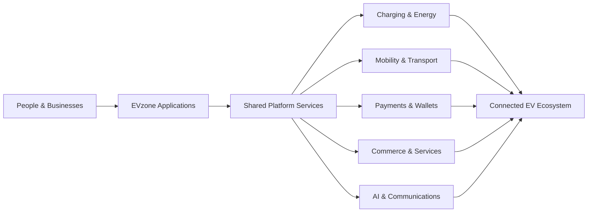

<!--
  EVzone Group organization profile README
  Display path on GitHub: EVzone-Group-Dev/.github/profile/README.md
-->

# EVzone Group

### Building connected infrastructure for electric mobility and digital services

EVzone develops technology that brings together **electric mobility, charging, transport, payments, commerce, communications, and intelligent operations** in one connected ecosystem.

 

**Built in Africa. Designed for global scale.**

---

## About EVzone

EVzone is building a unified technology ecosystem for the transition to cleaner, smarter, and more connected services.

Our platforms are designed to help individuals, businesses, operators, institutions, and public-service partners access dependable digital infrastructure through secure applications, interoperable services, and scalable platform foundations.

## What We Build

| Ecosystem | Focus |
|---|---|
| ⚡ **EV Charging & Energy** | Public and private charging, charge-point operations, station management, roaming, battery swapping, fleet charging, and energy services |
| 🚘 **Mobility & Transport** | Rider and driver experiences, dispatch, school transport, fleet operations, vehicle services, and mobility administration |
| 💳 **EVzone Pay** | Personal wallets, organization payments, peer-to-peer transactions, collections, settlements, and embedded payment services |
| 🛒 **Digital Commerce** | Buyer, seller, marketplace, retail, service-commerce, and creator platforms |
| 🤖 **AI & Communications** | Intelligent assistants, messaging, workflow automation, customer engagement, and machine-learning services |
| 🏫 **Connected Services** | Education, safety, tracking, events, healthcare, travel, and other ecosystem applications |

## Our Platform Direction

We are working toward an ecosystem where users can move between services with a consistent identity, trusted payments, shared platform capabilities, and a unified experience.

## Engineering Principles

- **Security by design** — identity, authorization, privacy, auditing, and secure financial operations are treated as foundational requirements.
- **Interoperability first** — open standards and well-defined APIs enable systems, partners, vehicles, chargers, and services to work together.
- **API-driven architecture** — reusable platform services reduce duplication and support web, mobile, operator, and partner experiences.
- **Scalable foundations** — systems are designed for reliability, observability, fault tolerance, and progressive regional growth.
- **Backend authority** — critical states, balances, permissions, pricing, and operational workflows are controlled by trusted backend services.
- **Sustainable innovation** — every product should contribute to cleaner mobility, broader access, and efficient digital infrastructure.

## Technology

Our charging infrastructure also works toward standards-based integration, including **OCPP**, **OCPI**, and other open e-mobility protocols.

## Working With Our Repositories

Most EVzone repositories contain active product development and may remain private while systems are being built, tested, secured, or prepared for release.

For repositories available to you:

1. Read the project `README.md`, architecture notes, and environment examples.
2. Create a focused branch from the repository's current default branch.
3. Keep commits small, descriptive, and limited to one concern.
4. Open a pull request with clear testing evidence and implementation notes.
5. Never commit credentials, API keys, private certificates, or production data.

## Security

Please do not publish suspected vulnerabilities, credentials, customer information, or infrastructure details in a public issue.

Report security concerns privately to an EVzone organization administrator or through the official security contact provided by the relevant repository.

## Explore EVzone

 

**Cleaner mobility. Connected services. One digital ecosystem.**

