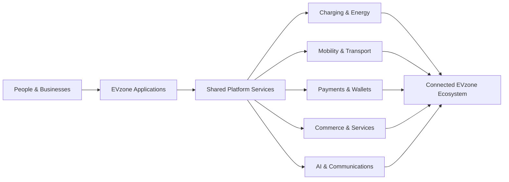

# EVzone Group

### Building connected infrastructure for electric mobility and digital services

EVzone is creating a unified ecosystem that brings together **electric mobility, charging, transport, payments, commerce, education, healthcare, communications, and intelligent operations**.

**Built in Africa. Designed for global scale.**

---

## About EVzone

EVzone develops secure, interoperable, and scalable digital platforms for people, businesses, mobility operators, institutions, and public-service partners.

Our goal is to make essential services work together through shared identity, trusted payments, intelligent automation, connected infrastructure, and consistent user experiences.

## Our Platform Ecosystem

  

### Core platform areas

| Platform area | What we are building |
|---|---|
| **EV Charging & Energy** | Public and private charging, charge-point operations, station management, roaming, battery swapping, fleet charging, and energy services |
| **Mobility & Transport** | Rider and driver applications, dispatch, school transport, fleet operations, vehicle services, and mobility administration |
| **EVzone Pay** | Personal wallets, peer-to-peer payments, collections, settlements, and embedded payment services |
| **CorporatePay** | Organization wallets, controlled spending, approvals, business payments, and financial operations |
| **AI & Communications** | Intelligent assistants, messaging, workflow automation, customer engagement, and machine-learning services |
| **Connected Services** | Education, healthcare, travel, investments, safety, tracking, events, and other ecosystem applications |

## Marketplace & Service Brands

  

Our commerce ecosystem supports specialized marketplace experiences across mobility, services, property, lifestyle, education, healthcare, faith, electronics, general retail, and rapid delivery.

## Platform Direction

We are working toward an ecosystem where users can move between services with a consistent identity, trusted payments, shared platform capabilities, and a unified experience.

## Engineering Principles

- **Security by design** — identity, authorization, privacy, auditing, and secure financial operations are foundational requirements.
- **Interoperability first** — open standards and well-defined APIs connect partners, vehicles, chargers, services, and applications.
- **Backend authority** — critical balances, permissions, pricing, payment states, and operational workflows are controlled by trusted backend services.
- **Scalable foundations** — systems are designed for reliability, observability, resilience, and progressive regional growth.
- **Reusable platform services** — shared capabilities reduce duplication across web, mobile, operator, and partner experiences.
- **Sustainable innovation** — every product should contribute to cleaner mobility, broader access, and efficient digital infrastructure.

## Technology

Our charging infrastructure also works toward standards-based integration, including **OCPP**, **OCPI**, and other open e-mobility protocols.

## Working With Our Repositories

Most EVzone repositories contain active product development and may remain private while systems are being built, tested, secured, or prepared for release.

For repositories available to you:

1. Read the project `README.md`, architecture notes, and environment examples.
2. Create a focused branch from the repository's current default branch.
3. Keep commits small, descriptive, and limited to one concern.
4. Open a pull request with clear testing evidence and implementation notes.
5. Never commit credentials, API keys, private certificates, or production data.

## Security

Please do not publish suspected vulnerabilities, credentials, customer information, or infrastructure details in a public issue.

Report security concerns privately to an EVzone organization administrator or through the official security contact provided by the relevant repository.

---

 

**Cleaner mobility. Connected services. One digital ecosystem.**

